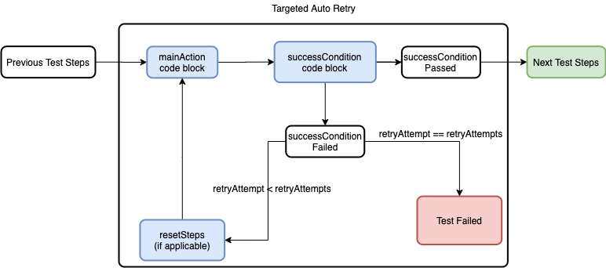

## Powerful Resilience Against Flaky Test Steps

<p align="center">
  
</p>

Flaky tests are a notorious industry wide problem, especially for UI tests. Ever since powerful automated testing tools have been available, developers and testers have struggled to reduce their flakiness.
## Global Auto Retry
The most common solution to flakiness are quarantine (not running the tests) and Global Auto Retry -- running a test suite, group together the failures, and retry just the failures.  Global Auto Retry solves the flakiness problem, but it has some disadvantages:
* It will fail to catch important intermittent bugs. Or at best, with a sophisticated test report solution, it will pass the test with an indication that it experienced flakiness somewhere in the execution. This makes it even easier to incorrectly dismiss important intermittent bugs than without any auto retry logic. That is, when it comes to letting your automation work for you by catching important intermittent bugs, Global Auto Retry causes more harm than good.
* No built-in support for global auto retry in Xcode / xcodebuild / Android Studio / etc.. Any solution for this needs to be home-grown, which is a significant undertaking. Even among major global tech companies, many teams haven't had the freedom to spend time investing in building this solution. 
* As it takes a significant investment to build up, it also requires more time to support and maintain this solution. 
* It's a heavy-handed approach, taking extra time to re-run an entire test. Retry logic is not optimized around specific actions which are most likely to be flaky.
* Also, since it's a heavy-handed approach, reporting is limited. Test runs may generate several runs worth of logs for a single test, which requires effort to sort through to find actionable data.
Easy to be abused by smoothing over poorly-written test code. Developers and testers may not know that their test code is flaky and inefficient if it's passing. Global Auto Retry makes it easier to write bad code by mistake.

## Targeted Auto Retry
Instead of retrying entire tests on failure, Targeted Auto Retry focuses on retrying just the steps which are most likely to cause issues with flakiness. 

In our experience, using Targeted Auto Retry with just a few common test steps is enough to eliminate 99% of flakiness from most teams' entire regression test suites.

Here's how it works:



* First you identify a test step which is prone to flakiness (app launch is usually a good candidate to start, but any test step will work). 
* The mainAction for the test step runs (e.g. XCUIApplication().launch()).
* A successCondition validates whether the mainAction step was successful (e.g. XCUIApplication().buttons["My Awesome App"].exists).
* If the successCondition is true, you move on to the rest of the test.
* If the successCondition is false then the mainAction test step failed, so you automatically circle back to retry the mainAction testStep.
* In some cases, you may need to add additional steps to reset the state of the test to just before the mainAction was attempted before retrying it, so an optional resetSteps code block is available to handle that if needed.
* And if the mainAction continues to fail consistently (meaning the successCondition continues to be false) eventually it stops attempting retries and just fails the whole test.

This Targeted approach has a few advantages over the Global approach:
* By only focusing on specific steps prone to flakiness, it greatly increases the chances of catching important intermittent bugs, getting the most benefit from your automation.
* It doesn't subtly mask over poorly written / flaky code. It's always an explicit and conscious choice to include Targeted Auto Retry for a test step.
* It's surprisingly light-weight and easy to implement. Code is provided here for Swift, and it's easy to extend the concept to any other modern language. Most Swift developers / testers should be able to get it up, working, and see immediate benefits within a single afternoon. 
* Console logging is already baked into the solution through `XCTContext.runActivity`. So relevant, actionable information about Auto Retries will be easy to find in any test reporting system, without needing to sort through multiple test run logs. These logs also provide flags set in the test steps, which can be used in test reporting solutions to pull out actionable metrics around the retry attempts:.  They also support eye-catching emojis to quickly draw your attention to what's happening:

♻️♻️♻️ [RETRY INFO: 2] Launch Attempt Unsuccessful.  Number of attempts: 3.  Attempts remaining: 1.  Retrying.

♻️♻️♻️▶️ [NEW RETRY ACTION: 1] Sign In.  Rerty attempt: 1.  Attempts remaining 2.

♻️♻️♻️⏱ [SUCCESS CONDITION: 3] Wait for Success Condition for action: Navigate To HomePage. Retry attempt:3.  Attempts remaining: 0

♻️♻️♻️⏪ [RESET STEPS: 2] Run Reset Steps to Retry action

♻️♻️♻️❌ [FAIL] Auto Retry failed 3 times for action: Search for Nike Shoes.  No more retries will be attempted.
* Since it's targeted, the execution time is faster than global solutions. Also, the solution is more configurable / optimizable for potential flakiness in each test step.
* The provided Swift solution also uses `#file` and `#line` macros to push information to the XCTAssert about the file and line of the test using `autoRetry`, which allows any failures to be reported on the test case layer in Xcode for clarity. 

It's worth pointing out that it is entirely possible to run both Global Auto Retry and Targeted Auto Retry at the same time. Suppose your team has already invested in a Global Auto Retry solution that you like, and you're not looking to ditch it completely for Targeted Auto Retry, but you want to find ways to tune up your solution and make it run more efficiently. You can add Targeted Auto Retry to your tests just as easily to improve and optimize your performance.

## When Not To Use Targeted Auto Retry
Targeted Auto Retry is a powerful solution.  By design, every use is intentional.  This means that, unlike with Global Auto Retry, it's less likely that Targeted Auto Retry will accidentally gloss over bad code.  However, it's still entirely capable of covering for bad / flaky code by re-trying until it works.  Be sure to only use Targeted Auto Retry in cases where:
* you have exhausted attempts to fix the flakiness directly
* the test step being auto-retried is part of the setUp / tearDown for the main focus of the test
* if there is a real intermittent bug in the test step, you don't want your test to catch it (note, the retry information will be captured in logs, and if your team uses an automation reporting system which exposes those logs, such as eBay's lucid-xc-reporter which will be open sourced in 2021 Q3, you will be able to see which tests were impacted by targeted retry attempts.  This is considered best practice for visibility)
* there is a separate test focused on this test step without auto retry, which will catch real intermittent bugs

---
## Walkthrough: Adding TargetedAutoRetry To Your Swift Project By Adding Package Dependency
See [Apple's guide to adding Package Dependencies to your app](https://developer.apple.com/documentation/xcode/adding_package_dependencies_to_your_app).
* In Xcode, open File -> Swift Package -> Add Package Dependency.
* If your app uses multiple projects, select the relevant project.
* In the "Enter package repository URL" field, enter "https://github.com/eBay/TargetedAutoRetry"
* Select Version, Up to Next Major.  
* Enter "1.0.0" for the version number.
* Add `import TargetedAutoRetry` to a base test class file, and add the `import TargetedAutoRetry` in that file at the top, next to `import XCTest`.  Then add the `TargetedAutoRetry` protocol to your base test class. For example, if you have a base test class called `class MyAwesomeBaseTestClass: XCTestCase`, add the protocol there: `class MyAwesomeBaseTestClass: XCTestCase, TargetedAutoRetry`. All subclasses will inherit the same functionality without needing to import or add the protocol again.
* Start implementing autoRetry in for any test steps which are prone to flakiness:

For example, instead of using XCUIApplication().launch(), replace it with:
```
autoRetry(
    mainAction: { XCUIApplication().launch() },
    successCondition: { XCUIApplication().buttons["Foo"].exists },
    actionDescription: "Launch"
)
```
[Note: for robust results, you'll probably want to use some kind of smart wait logic for your successCondition code blocks, but the implementation is up to you]. Or for sign in, assuming there are existing signIn() , isSignedIn() ->  Bool, and launch() methods:
```
autoRetry(
    mainAction: { signIn(username, password) },
    successCondition: isSignedIn,
    resetSteps: launch,
    actionDescription: "Sign In"
)
```
And that's it! You've just solved flakiness for those test steps. 

[Note: For the first steps in a test, the resetSteps would likely be launch, but later on in a test, you may be able to save time by invoking steps to reset the app to just before the mainAction without starting all over from launch. This helps achieve the best performance benefits possible from this solution.]

[Note: A quick optimization in this code could be to use [weak self] for the code blocks to avoid potential memory leaks. There are a number of different ways to work with code blocks in Swift and other modern languages. The TargetedAutoRetry protocol is designed to be flexible, you can use whatever pattern works best for you.]

In our experience, using Targeted Auto Retry with just a few common test steps is enough to eliminate the vast majority of flakiness from most teams' entire regression test suites.

[Note: Targeted Auto Retry is a powerful tool. It should be used for test steps where you are confident it's not reasonably possible to remove their flakiness directly by improving the code. One of its advantages over Global Auto Retry is that it doesn't silently bandaid over flakiness caused by bad code. But it is still capable of being abused by deliberately choosing to use it to wrap over bad code.]

There are a number of implementation examples in [TargetedAutoRetryTests.swift](Tests/TargetedAutoRetryTests/TargetedAutoRetryTests.swift)

---

## Configuring the solution
Targeted Auto Retry comes with a few built-in configurable parameters:

* retryAttempts: the number of retries to attempt before failing the test. Defaults to 3.

* actionDescription: optional custom description of the test step for use in reporting. This is used in the console reporting logs. e.g. for "Launch":
♻️♻️♻️▶️ [NEW RETRY ACTION: 2] Launch. Retry attempt: 2. Attempts remaining: 1

* failTestOnFailure: defaults to true, but in certain limited edge cases (such as nesting auto retry steps) it can make sense to not want to fail the test after using up all retry attempts.

That has been enough to support all the native teams at eBay up to now. But the solution is very light-weight, so it would be easy to extend it to adopt additional functionality if needed.

---

## Advanced Uses
In some cases, you may find utility in a nested solution. This could happen if your app has multiple test steps in a row where each one is susceptible to flakiness.
Imagine the following scenario:
launch(), signIn(), and navToPage() are each susceptible to flakiness in your app.
You wrap each one individually in autoRetry logic, but it still isn't fixing the flakiness issue for you:
```
func testMyAwesomeTest() {
    autoRetry(
        mainAction: launch,
        successCondition: isLaunched,
        actionDescription: "Launch"
    )
    autoRetry(
        mainAction: signIn,
        successCondition: isSignedIn,
        resetSteps: launch,
        actionDescription: "Sign In"
    )
    autoRetry(
        mainAction: navToPage,
        successCondition: pageLoaded,
        resetSteps: navToHomePage,
        actionDescription: "Navigate To Page"
    )
    ...
    //test something on the page
}
```
One option is to nest the autoRetries together:
```
func launchWithRetries() {
    autoRetry(
        mainAction: launch,
        successCondition: isLaunched,
        actionDescription: "Launch"
    )
}
func signInWithRetries() {
    autoRetry(
        mainAction: signIn,
        successCondition: isSignedIn,
        resetSteps: launch,
        actionDescription: "Sign In"
    )
}
func navToPageWithRetries() {
    autoRetry(
        mainAction: navToPage,
        successCondition: pageLoaded,
        resetSteps: navToHomePage,
        actionDescription: "Navigate To Page"
    )
}
func launchSignInNavToPage() {
    autoRetry(
        mainAction: { 
            launchWithRetries()
            signInWithRetries()
            navToPageWithRetries()
        },
        successCondition: pageLoaded,
        actionDescription: "Launch, Sign In, and Navigate To Page"
    )
}
```
In this example, if one of the child-level autoRetries failed after exhausting its retry attempts, it would fail the entire test, even if the parent-level autoRetry was only on its first attempt. In order to allow the most flexibility, the child-level autoRetries could be passed the parameter failTestOnFailure: false, while the parent-level retries keep the default value of failTestOnFailure: true.
```
func launchWithRetries(failTestOnFailure: Bool = true) {
    autoRetry(
        mainAction: launch,
        successCondition: isLaunched,
        actionDescription: "Launch",
        failTestOnFailure: failTestOnFailure    
    )
}
func signInWithRetries(failTestOnFailure: Bool = true) {
    autoRetry(
        mainAction: signIn,
        successCondition: isSignedIn,
        resetSteps: launch,
        actionDescription: "Sign In",
        failTestOnFailure: failTestOnFailure
    )
}
func navToPageWithRetries(failTestOnFailure: Bool = true) {
    autoRetry(
        mainAction: navToPage,
        successCondition: pageLoaded,
        resetSteps: navToHomePage,
        actionDescription: "Navigate To Page",
        failTestOnFailure: failTestOnFailure
    )
}
func launchSignInNavToPage() {
    autoRetry(
        mainAction: { 
            launchWithRetries(failTestOnFailure: false)
            signInWithRetries(failTestOnFailure: false)
            navToPageWithRetries(failTestOnFailure: false)
        },
        successCondition: pageLoaded,
        actionDescription: "Launch, Sign In, and Navigate To Page"
    )
}
```
From there, any tests depending on launch, signIn, and navToPage working as a precondition can just call that function, without having to think about the autoRetry logic at all. All the work going into it will be hidden from view of the test to keep the test logic clean:
```
func testMyAwesomeTest() {
    launchSignInNavToPage()
    ...
    //test something on the page
}
```
---
### Contributing
Developed by Evan Pierce.

Developing solutions for other platforms and languages is encouraged and will be shared and credited.

## License Information
Copyright 2020 eBay Inc.<BR>
Developer/Architect: Evan Pierce <BR>

Licensed under the Apache License, Version 2.0 (the "License"); you may not use this file except in compliance with the License. You may obtain a copy of the License at

https://www.apache.org/licenses/LICENSE-2.0

Unless required by applicable law or agreed to in writing, software distributed under the License is distributed on an "AS IS" BASIS, WITHOUT WARRANTIES OR CONDITIONS OF ANY KIND, either express or implied. See the License for the specific language governing permissions and limitations under the License.
